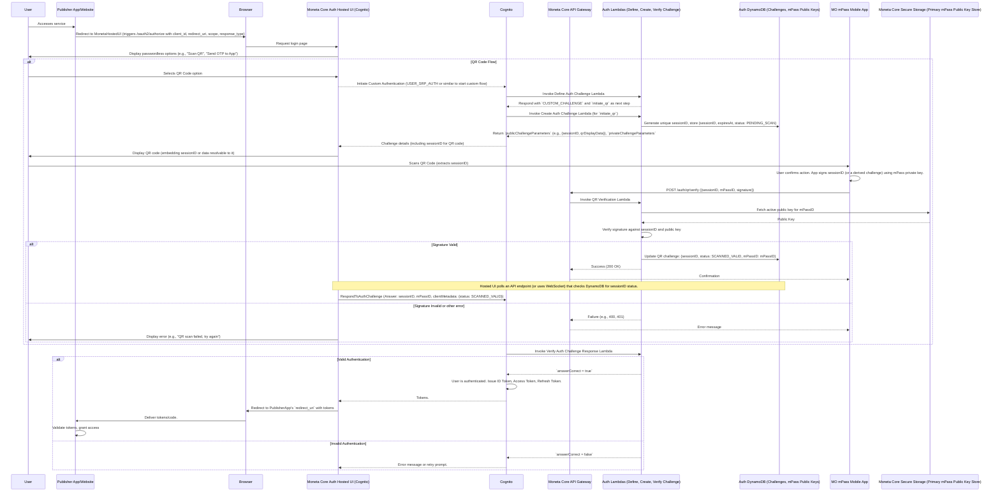

# ADR-015: Moneta Network Authentication and Identification

**Status:** Proposed  
**Date:** 2025-06-01

---

## Table of Contents

1. [Context](#1-context)
2. [Main Use Cases](#2-main-use-cases)
   - 2.1. [Authentication Flows](#21-authentication-flows)
   - 2.2. [Partner (MO & Publisher) Management](#22-partner-mo--publisher-management)
   - 2.3. [mPass Management](#23-mpass-management)
3. [Decision](#3-decision)
4. [Consequences](#4-consequences)
   - [Pros](#pros)
   - [Cons](#cons)
   - [Risks & Mitigations](#risks--mitigations)
5. [Technical Details](#5-technical-details)
   - 5.1. [OIDC Passwordless Authentication Flow](#51-oidc-passwordless-authentication-flow)
   - 5.2. [Human-Friendly Identifiers, Tiers, Billing & Lifecycle](#52-human-friendly-identifiers-tiers-billing--lifecycle)
   - 5.3. [Cross-Cutting Technical Requirements](#53-cross-cutting-technical-requirements)
   - 5.4. [Security Assessment Summary](#54-security-assessment-summary)
6. [Open Issues / Next Steps](#6-open-issues--next-steps)
7. [Story Definition](#7-story-definition)
   - 7.1. [Authentication Flow Stories](#71-authentication-flow-stories)
   - 7.2. [Partner (MO & Publisher) Management Stories](#72-partner-mo--publisher-management-stories)
   - 7.3. [mPass Management Stories](#73-mpass-management-stories)

---

## 1. Context

The Moneta Network is a platform involving Membership Organizations (MOs), Publishers, and a central Moneta Core. It aims to facilitate user authentication for accessing Publisher services and manage transactions, similar to a payment network. MO users leverage an mPass (analogous to a Visa card), with private keys stored on their MO-managed mobile application and public keys in Moneta Core. The platform will operate globally.

### Current Challenges & Requirements:

#### Authentication:
Design a secure OIDC-based passwordless authentication system managed by Moneta Core, using AWS Cognito, Lambda, DynamoDB, and API Gateway. Common flows involve users clicking a "Login with Moneta mPass" button on Publisher sites/apps, redirecting to Moneta Core's hosted UI, authenticating via their mPass mobile app (QR scan, OTP), and then being redirected back to the Publisher with OIDC tokens. The system must support session management, token revocation, refresh tokens, and SSO for publisher groups.

#### Identification:
The current UUIDv4 identifiers for MOs, Publishers, and mPasses (MO UUID + User UUID) are not human-friendly. A new coding/alias scheme is needed, supporting global scale, high availability, performance, and security.

#### Lifecycle Management:
The identifier system must support the lifecycle of MOs, Publishers (pending, destroy) and mPasses (pending, destroy, expiration, user lock, moving mPass between devices, mobile break/recovery).

#### Key Management:
An mPass should link to one active key pair and store several expired key pairs. Multiple encryption and signing algorithms need to be supported/suggested.

#### mPass Tiers:
Each mPass should be assigned a tier (e.g., Standard, Platinum). Tier information will influence policies like consumption limits and accepted debt amounts. Business flows for tier management (e.g., upgrades) are needed.

#### Billing Account Management:
mPasses, issued by MOs, need to be associated with billing accounts. Types include:

- **Individual Account:** Default; user is responsible for payments.
- **Company Account:** Multiple mPasses under one account; company owner handles payments.
- **Family Account:** Similar to Company, but one specific mPass acts as account owner, sets policies for other mPasses under the account, and is responsible for all charges.

#### Technical Stack:
Primarily AWS serverless (Cognito, Lambda, DynamoDB, API Gateway), but open to other AWS services (S3, RDS, SNS). EKS is mentioned but serverless is preferred for this module.

#### Non-Functional Requirements:
Low authentication latency, data synchronization capabilities between Moneta Core modules, extensibility for future auth methods.

#### Development & Operations:
Recommendations for Lambda development stack and CI/CD.

#### Risk Assessment:
Security risks, pros, and cons for the overall solution and specific authentication methods.

### Goals:

1. To design a robust, secure, and user-friendly OIDC passwordless authentication mechanism.
2. To propose a human-readable and manageable identification scheme for MOs, Publishers, and mPasses, incorporating tier and billing account structures.
3. To outline the technical architecture and operational considerations for these systems, ensuring scalability, security, and maintainability.

---

## 2. Main Use Cases

This section outlines the primary business functions addressed by this ADR, grouped by functional area.

### 2.1. Authentication Flows

This group covers how users authenticate to access publisher services and how their sessions are managed.

#### Use Cases:
- User Authenticates to Publisher via Moneta Core
- User Logs Out from Publisher
- User Experiences SSO across Grouped Publishers
- Moneta Core System Manages User Session

#### Narrative:
The primary authentication flow involves a User attempting to access a Publisher System. The Publisher System redirects the User to the Moneta Core System for authentication. The User selects a passwordless method (e.g., QR scan, OTP) and uses their mPass Mobile App to complete the challenge presented by Moneta Core. Upon successful authentication, Moneta Core issues OIDC tokens back to the Publisher System, which then grants access to the User.

Beyond the initial login, the system supports:

- **Logout:** The User can initiate a logout from the Publisher System, which communicates with Moneta Core to invalidate the session and relevant tokens.
- **Refresh Token:** Publisher Systems can use refresh tokens to obtain new access tokens from Moneta Core without requiring the User to re-authenticate, maintaining a seamless experience.
- **SSO (Single Sign-On):** If a User is already authenticated with Moneta Core and accesses another Publisher System belonging to an affiliated group, Moneta Core facilitates SSO, allowing the User to access the new Publisher service without re-entering credentials.
- **Session Management:** Moneta Core is responsible for the overall lifecycle of the User's session, including creation, maintenance, and termination based on activity, token expiry, or explicit logout.

### 2.2. Partner (MO & Publisher) Management

This group covers the administrative functions for managing Membership Organizations (MOs) and Publishers on the Moneta Network.

#### Use Cases:
- Moneta Core Admin Onboards New MO
- Moneta Core Admin Views MO Details
- Moneta Core Admin Updates MO Configuration
- Moneta Core Admin Manages MO Lifecycle (e.g., Suspend, Activate, Destroy)
- Moneta Core Admin Onboards New Publisher
- Moneta Core Admin Views Publisher Details
- Moneta Core Admin Updates Publisher Configuration
- Moneta Core Admin Manages Publisher Lifecycle (e.g., Suspend, Activate, Destroy)

#### Narrative:
Partner management is primarily handled by a Moneta Core Admin interacting with the Moneta Core System.

For Membership Organizations (MOs), the Admin can perform CRUD (Create, Read, Update, Delete - though 'Delete' is more accurately 'Destroy' in lifecycle terms) operations. This includes onboarding new MOs, configuring their parameters (e.g., assigning MICs, setting up communication endpoints), viewing their status and details, and managing their lifecycle (pending approval, active, suspended, destroyed). Changes in the Moneta Core System might trigger notifications or updates to the MO's own external systems.

Similarly, for Publishers, the Moneta Core Admin manages their onboarding, configuration (e.g., assigning MPCs, defining service endpoints, associating with SSO groups), viewing details, and lifecycle management. These actions ensure that only legitimate and correctly configured partners operate on the network.

### 2.3. mPass Management

This group covers the lifecycle and attribute management of individual mPasses, including their tiers and billing account associations.

#### Use Cases:
- MO Admin Issues New mPass to User
- User/MO Admin Views mPass Details
- User/MO Admin Updates mPass (e.g., user-lock, MO-initiated suspension)
- User/MO Admin Manages mPass Lifecycle (Destroy, Reactivate if applicable)
- Moneta Core System Manages mPass Expiration
- User Manages mPass Keys (implicitly, via device transfer/recovery flows)
- MO Admin Assigns/Upgrades/Downgrades mPass Tier
- MO Admin Associates mPass with Billing Account
- User (as Billing Account Owner) Manages Linked mPasses (e.g., for Family Accounts, setting policies)
- User (as Billing Account Owner) Views Consolidated Billing Information (handled by MO, Moneta Core provides data)

#### Narrative:
mPass management involves multiple actors and system interactions:

**Issuance & Lifecycle:** An MO Admin issues an mPass to a User via the Moneta Core System. The User activates and uses the mPass through their mPass Mobile App. Both the User (e.g., locking their mPass) and the MO Admin (e.g., suspending an mPass) can manage aspects of its lifecycle. Moneta Core automatically handles processes like mPass expiration.

**Key Management:** While not a direct CRUD operation by the user on keys, processes like transferring an mPass to a new device or recovering an mPass after a device break implicitly involve the generation of new key pairs on the mPass Mobile App, with the new public key being registered with Moneta Core.

**Tier Management:** The MO Admin is responsible for assigning an initial tier to an mPass and managing upgrades or downgrades based on business rules or user requests. This information is stored by Moneta Core and affects the policies applied to the mPass.

**Billing Account Management:** The MO Admin associates an mPass with a specific billing account (Individual, Company, or Family) within the Moneta Core System. For Family accounts, the designated Billing Account Owner (a User) can manage policies (e.g., spending limits) for other mPasses linked to their family account, typically via their mPass Mobile App, which then communicates these policy changes to Moneta Core.

These use cases define the core interactions for identity, access, and account management within the Moneta Network from the perspective of this ADR.

---

## 3. Decision

We will implement a custom OIDC passwordless authentication flow using AWS Cognito with AWS Lambda triggers for challenge management. For identifiers, we will introduce a structured, human-friendly coding scheme managed centrally by Moneta Core, alongside the existing UUIDs for internal referencing. This system will also incorporate mPass tiers and a flexible billing account structure.

### Key Components of the Decision:

#### OIDC Passwordless Authentication (Moneta Core Managed):

- **Identity Provider:** AWS Cognito User Pools will serve as the OIDC IdP.
- **Custom Authentication Flow:** Leverage Cognito's Define Auth Challenge, Create Auth Challenge, and Verify Auth Challenge Response Lambda triggers to implement passwordless methods (QR Code Scan, OTP to mPass App).
- **Hosted UI:** Cognito's Hosted UI will be customized to present these passwordless options.
- **API Gateway & Lambda:** API Gateway will expose necessary endpoints for the mPass mobile app to interact with during authentication (e.g., submit signed QR data, receive OTP instructions if not purely push-based). These will be backed by Lambda functions.
- **DynamoDB:** Used to store temporary challenge data (QR session IDs, OTP hashes), mPass public key references, and other authentication metadata.
- **Standard OIDC Features:** Session management, token revocation, and refresh token capabilities will be handled by Cognito.
- **SSO:** Cognito's native support for SSO across different app clients within the same user pool will be used for publisher groups.

#### Human-Friendly Identifiers, Tiers, Billing, & Lifecycle Management:

- **MO Code (Moneta Issuer Code - MIC):** A short, centrally assigned alphanumeric code (e.g., MOA01, 4-6 chars).
- **Publisher Code (Moneta Partner Code - MPC):** A short, centrally assigned alphanumeric code (e.g., PUBS7, 4-6 chars).
- **mPass Number:** A structured number, analogous to payment card numbers:
  - **MII (Moneta Issuer Identifier):** First 6-8 digits, globally unique, identifying the issuing MO (linked to MIC).
  - **MAI (Moneta Account Identifier):** Next 8-12 digits, assigned by the MO, unique within that MO.
  - **VC (Verification Character):** 1 character (e.g., Luhn check digit).
  - **Example:** 123456-7890123456-A.
- **mPass Tiers:** An attribute associated with each mPass (e.g., "Standard", "Platinum") influencing its policies.
- **Billing Accounts:** A separate structure to manage how mPass charges are aggregated and paid, supporting Individual, Company, and Family models.
- **Storage & Management:** These codes, tiers, and billing account associations will be stored in DynamoDB, linked to their respective UUIDs. Moneta Core will manage their lifecycle (Pending, Active, Suspended, Destroyed, Expired) via APIs and automated processes.

#### mPass Key Management:

- Each mPass will be associated with one active public key and a history of inactive (expired, superseded) public keys.
- Public keys (with algorithm identifiers) stored in Moneta Core's secure storage.
- Private keys remain solely on the user's mPass mobile app.

**Supported Algorithms:**
- **Signing:** ECDSA (e.g., P-256, P-384), EdDSA (e.g., Ed25519).
- **Encryption:** (for data at rest within Moneta Core, if needed beyond standard SSE): AES-256 GCM.

---

## 4. Consequences

### Pros:

✅ **Enhanced User Experience:** Passwordless methods are generally faster and more user-friendly. Human-readable codes improve operational clarity.

✅ **Flexible Financial Management:** Tier and billing account structures allow for diverse product offerings and payment arrangements.

✅ **Leverages AWS Managed Services:** Reduces operational burden for Cognito, Lambda, DynamoDB, API Gateway, ensuring scalability and reliability.

✅ **Strong Security Foundation:** OIDC is an industry standard. Custom Lambda triggers allow granular control over authentication logic. Private keys remain on user devices, reducing central risk.

✅ **Extensibility:** Cognito's custom auth flow allows adding new passwordless methods in the future. Tier and billing models can also be expanded.

✅ **Centralized Control & Consistency:** Moneta Core manages authentication, the identifier namespace, tiers, and billing account structures.

✅ **SSO Capability:** Natively supported by Cognito for publisher groups.

✅ **Global Scalability:** AWS services provide global infrastructure. DynamoDB Global Tables can be used for low-latency reads of identifier/key data if needed.

### Cons:

❗ **Increased Implementation Complexity:** Custom authentication flows, tier logic, and billing account management add layers of complexity to design, development, and testing.

❗ **AWS Ecosystem Lock-in:** Significant reliance on AWS services.

❗ **Lambda Cold Starts:** Potential for increased latency for infrequently used auth/management functions if not mitigated (e.g., provisioned concurrency).

❗ **Mobile App Dependency:** The entire passwordless flow hinges on the security and functionality of the MO's mPass mobile application, which may also need to display tier/billing info.

❗ **Data Management Overhead:** Centralized management of codes, tiers, billing accounts, and their interdependencies requires robust processes and potentially more complex data models.

### Risks & Mitigations:

#### Security Risks:

**Compromised Lambda Functions:**
- **Mitigation:** Strict IAM roles (least privilege), regular code reviews, dependency scanning, security testing (SAST/DAST), AWS WAF on API Gateway.

**Insecure Mobile App Key Storage:**
- **Mitigation:** Mandate/strongly recommend MOs to ensure private keys are stored in hardware-backed secure enclaves. Provide clear security guidelines.

**QR Code Hijacking/Replay Attacks:**
- **Mitigation:** Short-lived, single-use QR codes/session IDs. Signing of the QR challenge response by the mPass app. Secure HTTPS. User education.

**OTP Interception/Phishing:**
- **Mitigation:** Short-lived OTPs. Binding OTPs to sessions. Rate limiting. Secure delivery. User education.

**Identifier Enumeration/Guessing:**
- **Mitigation:** Avoid strictly sequential assignment. Rate limiting on lookup APIs. Strong validation.

**Unauthorized Tier/Billing Modification:**
- **Mitigation:** Strong authorization controls on APIs managing tiers and billing accounts (e.g., only MO admins or designated account owners can make changes). Audit trails for all modifications.

**Denial of Service (DoS) against Auth Endpoints:**
- **Mitigation:** AWS Shield, AWS WAF, scalable serverless infrastructure.

#### Operational Risks:

**Moneta Core Auth Module as Central Point of Failure:**
- **Mitigation:** Multi-AZ deployments. Consider multi-region for critical components.

**Identifier/Code Collision:**
- **Mitigation:** Robust central management with atomic operations or strong consistency for assigning unique codes.

**Data Synchronization Failures:**
- **Mitigation:** Reliable eventing (EventBridge) with DLQs. Monitoring. Idempotent consumers.

**Complexity in Policy Enforcement:**
Ensuring correct application of policies based on tiers and family billing account rules requires careful logic and testing.
- **Mitigation:** Thorough testing of policy logic. Clear definition of policy rules. Versioning of policies.

---

## 5. Technical Details

### 5.1. OIDC Passwordless Authentication Flow

The OIDC passwordless authentication flow enables users to securely access Publisher services using their mPass without traditional passwords. The process is orchestrated by Moneta Core, leveraging AWS Cognito and custom Lambda functions.

#### Key Lambda Triggers in Cognito:
1. **Define Auth Challenge** - Determines the authentication flow sequence
2. **Create Auth Challenge** - Generates the specific challenge (QR code, OTP)
3. **Verify Auth Challenge Response** - Validates the user's response to the challenge

### 5.2. Human-Friendly Identifiers, Tiers, Billing & Lifecycle

#### Identifier Schemes:

- **MIC (Moneta Issuer Code)** - Short alphanumeric codes for MOs
- **MPC (Moneta Partner Code)** - Short alphanumeric codes for Publishers  
- **mPass Number (MII-MAI-VC)** - Structured numbers similar to payment cards

#### Data Storage (DynamoDB):

**MOTable:**
- `moID` (PK, UUIDv4)
- `mic` (GSI PK - Moneta Issuer Code, for lookup by human-friendly code)
- `status` (String: Pending, Active, Suspended, Destroyed)
- `name` (String, official name of the MO)
- `createdAt`, `updatedAt` (Timestamps)
- `metadata` (JSON blob for MO-specific details)

**PublishersTable:**
- `publisherID` (PK, UUIDv4)
- `mpc` (GSI PK - Moneta Partner Code)
- `status`, `name`, `ssoGroupID`
- `createdAt`, `updatedAt`, `metadata`

**MPassTable:**
- `mPassID` (PK, UUIDv4)
- `mPassNumber` (GSI PK - Human-friendly mPass number)
- `moID`, `userID_internal`, `status`, `tier`
- `billingAccountID`, `activePublicKeyID`
- `createdAt`, `updatedAt`, `expiresAt`, `metadata`

### 5.3. Cross-Cutting Technical Requirements

#### Tech Stack (AWS):
- **Core:** Cognito, Lambda, DynamoDB, API Gateway
- **Supporting:** S3, SNS, CloudFront, AWS WAF, EventBridge, KMS

#### Low Authentication Latency:
- **Lambda:** Provisioned Concurrency for critical auth Lambdas
- **DynamoDB:** Proper indexing, DAX for read-heavy operations
- **API Gateway:** Edge-optimized endpoints
- **Network:** CloudFront for global distribution

#### Data Synchronization:
- **DynamoDB Streams:** Enable on key tables
- **EventBridge:** Custom event bus for domain events
- **Stream Processor Lambda:** Publishes events for other microservices

### 5.4. Security Assessment Summary

#### Overall Solution:
**Strengths:** Leverages robust OIDC standard, AWS security features, passwordless reduces attack vectors, private keys on device.

**Weaknesses:** Complexity can introduce vulnerabilities, heavy reliance on mobile app security, Moneta Core auth is a critical target.

#### QR Code Authentication:
**Pros:** Good UX, contactless  
**Cons/Risks:** Shoulder surfing, QR replay attacks, man-in-the-middle  
**Mitigations:** Short-lived signed challenges, HTTPS, mPass app security

#### OTP to mPass App Authentication:
**Pros:** No camera needed, familiar to users  
**Cons/Risks:** OTP interception, phishing, push notification failures  
**Mitigations:** Short-lived OTPs, rate limiting, secure delivery channels

---

## 6. Open Issues / Next Steps

1. Detailed design of the mPass app interaction for key generation, secure storage, and display/management of tier/billing information.
2. Finalize the exact structure and character sets for MIC, MPC, and MII.
3. Develop a detailed recovery flow for users who lose access to their mPass app/device.
4. Perform a thorough threat modeling exercise on the chosen authentication flows, as well as tier and billing management processes.
5. Prototype the Cognito custom authentication flow with one method (e.g., QR code).
6. Define the specific attributes and structure for policySettings within the BillingAccountsTable for Family accounts.
7. Design APIs and internal logic for MOs and Family account owners to manage tiers and billing account policies.
8. Specify how tier/billing information is made available to Publishers and how policies are enforced at the transaction level.
9. Consider data migration strategies if existing mPasses need to be mapped to new tier/billing structures.
10. Refine GSI strategies for the new tables based on detailed access patterns.

---

## 7. Story Definition

This section lists user stories derived from the Main Use Cases section, intended for backlog management.

### 7.1. Authentication Flow Stories

**Auth-Story-001:** As an mPass User, I want to securely authenticate to a Publisher's service using a QR code scan via my mPass mobile app, so that I can access the Publisher's content or services.

**Auth-Story-002:** As an mPass User, I want to securely authenticate to a Publisher's service by receiving and confirming an OTP on my mPass mobile app, so that I can access the Publisher's content or services.

**Auth-Story-003:** As an mPass User, I want to log out from a Publisher's service, so that my session is terminated and my access is revoked.

**Auth-Story-004:** As a Publisher System, I want to refresh an mPass User's access token using a refresh token, so that the user can maintain their session without re-authenticating.

**Auth-Story-005:** As an mPass User, I want to experience Single Sign-On (SSO) when accessing different services from Publishers within the same group, so that I don't have to log in repeatedly.

**Auth-Story-006:** As a Moneta Core System, I want to manage the lifecycle of user sessions (creation, validation, expiry, termination), so that user access is secure and controlled.

**Auth-Story-007:** As a Publisher System, I want to receive OIDC ID and Access tokens after a successful user authentication, so that I can identify the user and authorize access to my resources.

**Auth-Story-008:** As a Publisher System (Resource Server), I want to validate an mPass Access Token presented by a client, so that I can ensure the request is authorized.

### 7.2. Partner (MO & Publisher) Management Stories

**Partner-Story-001:** As a Moneta Core Admin, I want to onboard a new Membership Organization (MO), providing all necessary details and configurations (e.g., assigning MIC), so that the MO can operate on the Moneta Network.

**Partner-Story-002:** As a Moneta Core Admin, I want to view the details and current status of any MO on the network, so that I can monitor and manage them effectively.

**Partner-Story-003:** As a Moneta Core Admin, I want to update the configuration of an existing MO, so that their operational parameters are current.

**Partner-Story-004:** As a Moneta Core Admin, I want to manage the lifecycle of an MO (e.g., move to Pending, Active, Suspended, Destroyed status), so that the network reflects their operational state.

**Partner-Story-005:** As a Moneta Core Admin, I want to onboard a new Publisher, providing all necessary details and configurations (e.g., assigning MPC, defining service endpoints), so that the Publisher can offer services on the Moneta Network.

**Partner-Story-006:** As a Moneta Core Admin, I want to view the details and current status of any Publisher on the network, so that I can monitor and manage them effectively.

**Partner-Story-007:** As a Moneta Core Admin, I want to update the configuration of an existing Publisher, so that their operational parameters are current.

**Partner-Story-008:** As a Moneta Core Admin, I want to manage the lifecycle of a Publisher (e.g., move to Pending, Active, Suspended, Destroyed status), so that the network reflects their operational state.

**Partner-Story-009:** As a Moneta Core Admin, I want to associate multiple Publisher app clients with the same Cognito User Pool, so that SSO can be enabled for that publisher group.

### 7.3. mPass Management Stories

**mPass-Story-001:** As an MO Admin, I want to issue a new mPass to a user, including assigning an mPass Number, initial tier, and associating it with a billing account, so that the user can utilize Moneta Network services.

**mPass-Story-002:** As an mPass User, I want to view the details of my mPass (e.g., mPass Number, tier, status) via my mPass mobile app.

**mPass-Story-003:** As an MO Admin, I want to view the details of any mPass issued by my MO, so that I can provide support and manage accounts.

**mPass-Story-004:** As an mPass User, I want to lock my mPass via my mobile app, so that it cannot be used for transactions if my device is compromised or lost.

**mPass-Story-005:** As an MO Admin, I want to suspend an mPass (e.g., due to reported fraud or non-payment), so that it cannot be used.

**mPass-Story-006:** As an MO Admin, I want to destroy an mPass (e.g., at user request or account closure), so that it is permanently deactivated.

**mPass-Story-007:** As a Moneta Core System, I want to automatically manage mPass expiration by changing its status when the expiration date is reached.

**mPass-Story-008:** As an mPass User, I want to transfer my mPass to a new mobile device, including generating new key pairs, so that I can continue using my mPass securely.

**mPass-Story-009:** As an mPass User, I want to recover my mPass on a new device if my old device is broken or lost, including generating new key pairs, so that I regain access to my mPass.

**mPass-Story-010:** As an MO Admin, I want to assign or change the tier of an mPass (e.g., Standard, Platinum), so that appropriate policies and benefits are applied.

**mPass-Story-011:** As an MO Admin, I want to associate an mPass with an Individual Billing Account, so that the user is responsible for their payments.

**mPass-Story-012:** As an MO Admin, I want to associate multiple mPasses with a Company Billing Account, so that the company can manage payments centrally.

**mPass-Story-013:** As an MO Admin, I want to set up a Family Billing Account, designating an owner mPass and linking other family member mPasses to it.

**mPass-Story-014:** As an mPass User (Family Account Owner), I want to set and manage policies (e.g., spending limits, category restrictions) for other mPasses within my Family Billing Account via my mPass mobile app.

**mPass-Story-015:** As a Moneta Core System, I want to store and manage one active public key and a history of inactive public keys for each mPass, along with the signing algorithm used.

**mPass-Story-016:** As a Publisher System, I want to be able to retrieve mPass details (like tier and applicable limits) from Moneta Core using an access token, so that I can apply relevant business rules.

---

*This ADR provides the foundational architecture and design decisions for implementing secure, passwordless authentication and human-friendly identification within the Moneta Network platform.* 