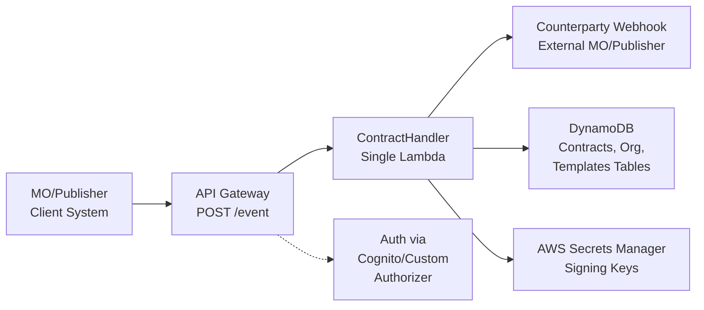
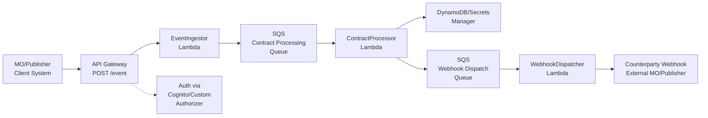
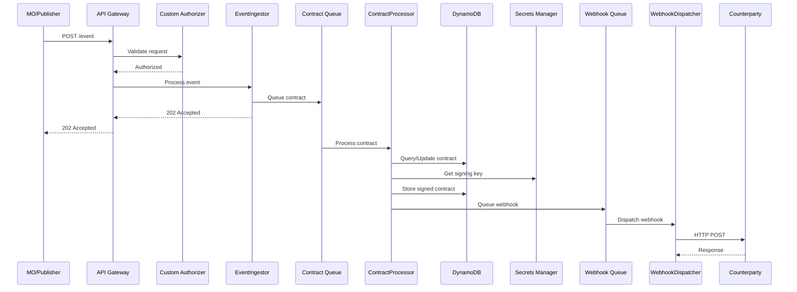
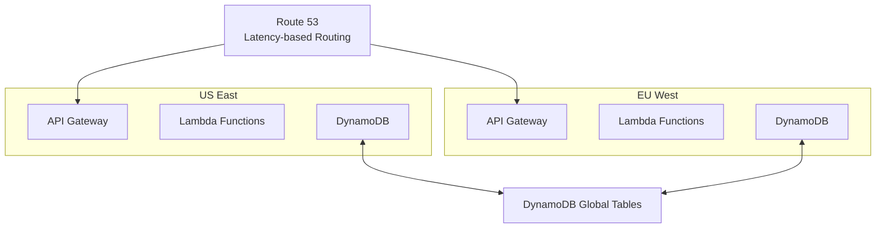

# ADR-021: Moneta Core Architecture

**Status:** Proposed  
**Date:** 2025-06-15

---

## Table of Contents

1. [Context](#1-context)
2. [Decision](#2-decision)
3. [Architecture Options](#3-architecture-options)
4. [Core Module Design](#4-core-module-design)
5. [Database Schema](#5-database-schema)
6. [Additional Modules](#6-additional-modules)
7. [Consequences](#7-consequences)
8. [Design Assessment](#8-design-assessment)

---

## 1. Context

The **Moneta Network** is a platform designed to facilitate transactions and interactions between **Membership Organizations (MOs)** and **Publishers**. The central hub, **Moneta Core**, acts as a trusted intermediary, ensuring all business flows are securely processed, verified, and recorded.

### Core Responsibilities

- Manage the lifecycle of MOs, publishers, and digital mPasses
- Handle transactions, disputes, reconciliation, and settlement processes
- Process versioned, multi-signature "Contracts" for all business operations
- Create auditable, non-repudiable trails for every significant event

### Technical Requirements

- **AWS Serverless** technologies for high throughput
- **10 million requests per month** with peaks of **1,000 requests per second**
- Secure, scalable, highly available, and cost-effective architecture

### Contract System

A core tenet is that all business processes are represented as versioned, multi-signature "Contracts":

1. Contracts initiated by MO or Publisher
2. Sent to Moneta Core for validation and signature
3. Forwarded to counterparty for completion
4. Creates complete audit trail

---

## 2. Decision

**We will adopt a decoupled, asynchronous architecture (Option 2) for event processing.**

While a synchronous model offers simplicity, it fails to meet the system's high-throughput and reliability requirements. The asynchronous design separates fast event ingestion from complex contract processing, ensuring scalability and resilience.

---

## 3. Architecture Options

### Option 1: Synchronous Monolithic Handler



### Option 2: Decoupled Asynchronous Handler (Selected)



### Architecture Comparison

| Criterion | Option 1: Synchronous | Option 2: Asynchronous (Selected) |
|-----------|----------------------|-----------------------------------|
| **Performance/Latency** | Poor. High latency for client, must wait for all processing including external webhook calls | Excellent. Very low latency for client (202 Accepted response), heavy processing is offloaded |
| **Reliability/Availability** | Low. Single failure (e.g., webhook timeout) causes entire request to fail. No built-in retries | High. SQS queues provide durability and automatic retries. Failures are isolated |
| **Scalability** | Poor. Throughput limited by slowest step (webhook). Cannot easily scale to 1000 req/sec | Excellent. Can easily absorb traffic spikes. Processing scales independently by adjusting Lambda concurrency |
| **Simplicity** | High. Logic in one place, easy to understand initially | Medium. More moving parts (queues, multiple Lambdas) require complex debugging and tracing |
| **Cost** | Slightly lower due to fewer components, but potentially higher compute costs from longer Lambda durations | Slightly higher due to SQS costs, but overall more cost-effective at scale due to optimized, shorter Lambda runs |

---

## 4. Core Module Design

### Event and Contract Flow

The critical `POST /event` flow implementation:

#### 1. API Gateway
- REST API entry point
- `/event` endpoint with Lambda proxy integration
- Custom Authorizer Lambda for authentication and authorization

#### 2. Contract Handling (ContractHandler Lambda)

**Workflow Steps:**

1. **Initial Validation** - Validate incoming event payload
2. **Template Retrieval** - Fetch contract template from DynamoDB (cached in memory)
3. **Contract Validation** - Validate payload and signatures against template rules
4. **Database Interaction** - Query/create/update Contracts table by `contract_id`
5. **Optimistic Locking** - Handle concurrent updates safely
6. **Signing** - Retrieve Moneta's private key and sign contract
7. **Dispatching** - Call counterparty's webhook via HTTP request
8. **Response** - Return final status (200 OK or error code)
9. **Logging** - Log to CloudWatch with AWS X-Ray tracing

### Example Contract Template

```yaml
# Contract Template Example
template_name: "transaction-contract"
version: 1
schema:
  required_fields:
    - contract_id
    - mo_id
    - publisher_id
    - mpass_id
    - amount
    - currency
signature_rules:
  required_signatures: ["mo", "moneta", "publisher"]
  signing_order: ["mo", "moneta", "publisher"]
```

### Event Processing Sequence



---

## 5. Database Schema

### DynamoDB Tables

#### Contracts Table

| Field | Type | Description |
|-------|------|-------------|
| `contract_id` | String (PK) | Unique contract identifier |
| `description` | String | Human-readable contract purpose |
| `template_id` | String | Links to ContractTemplates table |
| `mo_id` | String | FK to MembershipOrganizations |
| `publisher_id` | String | FK to Publishers table |
| `mpass_id` | String | FK to MPasses table |
| `version` | Number | Contract template version |
| `payload` | Map | Contract data payload |
| `signatures_map` | Map | Signatures from all parties |
| `event_logs` | List | Event history for this contract |
| `status` | String | Current contract status |
| `created_at` | Number | Unix timestamp |
| `finalized_at` | Number | Unix timestamp |

**Global Secondary Indexes:**
- GSI1: `mo_id` (PK)
- GSI2: `publisher_id` (PK) 
- GSI3: `mpass_id` (PK)
- GSI4: `status` (PK), `created_at` (SK)

#### MembershipOrganizations Table

| Field | Type | Description |
|-------|------|-------------|
| `id` | String (PK) | UUID v4 identifier |
| `mic` | String (GSI-PK) | Moneta Issuer Code |
| `name` | String | Official MO name |
| `status` | String | Current status (Pending, Active, Suspended, Destroyed) |
| `createdAt` | Number | Unix timestamp |
| `updatedAt` | Number | Unix timestamp |
| `metadata` | Map | MO-specific details (contact info, webhooks, config) |
| `certificates` | List | Associated certificate identifiers |
| `services` | List | Supported service codes |
| `industries` | List | Applicable industry codes |

#### ContractTemplates Table

| Field | Type | Description |
|-------|------|-------------|
| `template_name` | String (PK) | Template identifier (e.g., "transaction-contract") |
| `version` | Number (SK) | Template version number |
| `description` | String | Human-readable description |
| `created_at` | Number | Unix timestamp |
| `is_latest` | Boolean | Flag for current active version |
| `template_payload` | String | Full YAML content (schema rules, signature rules) |

### Example Contract Data Structure

```json
{
  "contract_id": "contract_12345",
  "template_id": "transaction-contract",
  "mo_id": "mo_abcdef",
  "publisher_id": "pub_xyz789",
  "mpass_id": "mpass_123456",
  "version": 1,
  "payload": {
    "transaction": {
      "amount": 100.00,
      "currency": "USD",
      "description": "Premium service access"
    }
  },
  "signatures_map": {
    "mo": {
      "signature": "0x...",
      "timestamp": 1640995200,
      "public_key": "0x..."
    },
    "moneta": {
      "signature": "0x...",
      "timestamp": 1640995260,
      "public_key": "0x..."
    }
  },
  "event_logs": [
    {
      "event": "contract_created",
      "timestamp": 1640995200,
      "actor": "mo_abcdef"
    },
    {
      "event": "contract_signed",
      "timestamp": 1640995260,
      "actor": "moneta_core"
    }
  ],
  "status": "pending_publisher_signature",
  "created_at": 1640995200,
  "finalized_at": null
}
```

---

## 6. Additional Modules

### Organization Management
- **Functionalities:** MO/Publisher lifecycle, certificates, services, policies
- **APIs:** 
  - `POST /organizations/mo` - Create MO
  - `PUT /organizations/mo/{id}` - Update MO
  - `GET /organizations/mo/{id}` - Get MO details

### mPass Management  
- **Functionalities:** mPass lifecycle, certificates, policies
- **APIs:**
  - `POST /mpass` - Issue new mPass
  - `PUT /mpass/{id}/status` - Update status
  - `GET /mpass/{id}` - Get mPass details

### Transaction Management
- **Integration:** Binds with Core module for transaction contracts
- **Purpose:** Business logic for financial transaction validation and processing

### Settlement Management
- **Integration:** Binds with Core module for settlement contracts  
- **Purpose:** Calculate and record revenue splits between parties

---

## 7. Consequences

### 7.1. Pros

- **Immediate Feedback:** Client receives definitive response immediately  
- **Strong Consistency:** Synchronous processing ensures data consistency
- **Simplified Debugging:** Single flow easier to trace and debug

### 7.2. Cons

- **Reduced Performance & Scalability:** High API latency due to synchronous processing
- **Lower Availability & Resilience:** System brittle to single point failures
- **Lambda Timeout Risk:** Combined execution time may exceed limits
- **High Throughput Challenges:** Difficult to meet 1000 req/sec with synchronous model

---

## 8. Design Assessment

### 8.1. Security

#### Authentication & Authorization
- Custom Lambda Authorizer validates signed requests from MOs and Publishers
- JWT tokens with RSA signatures
- Strict input validation prevents injection attacks

#### Data Protection
- TLS 1.2+ for all communications
- DynamoDB encryption at rest with AWS KMS
- AWS Secrets Manager for private keys

### 8.2. Performance

#### Performance Targets

| Metric | Target | Current Design |
|--------|--------|----------------|
| API Response Time | <200ms | 500-2000ms (synchronous) |
| Peak Throughput | 1000 req/sec | ~100 req/sec (limited by webhook) |
| Database Query Time | <10ms | <5ms (partition key) |
| Contract Processing | <1s | 2-5s (including webhook) |

### 8.3. Cost Estimation

**Monthly Cost Analysis**  
*Based on 10M contracts/month*

| Service | Component | Cost/Month |
|---------|-----------|------------|
| **DynamoDB** | Writes, Reads, Storage | $607.50 |
| **AWS Lambda** | Compute & Requests | $30.00 |
| **API Gateway** | HTTP API | $10.00 |
| **SQS** | Messages | $8.00 |
| **Other** | CloudWatch, Secrets, etc. | $100.00 |
| **Total** | | **$755.50** |

### 8.4. Multi-Region Strategy

#### Global Architecture



#### Path to Globalization

1. **Multi-Region Deployment:** Deploy to multiple AWS regions with Route 53 latency-based routing
2. **Global Data Plane:** DynamoDB Global Tables for cross-region replication  
3. **Async Processing:** Replace synchronous webhooks with event-driven patterns
4. **Data Residency:** Regional isolation for compliance requirements

---

*This document defines the foundational architecture for Moneta Core, focusing on contract and event management with high throughput, security, and scalability requirements.*
