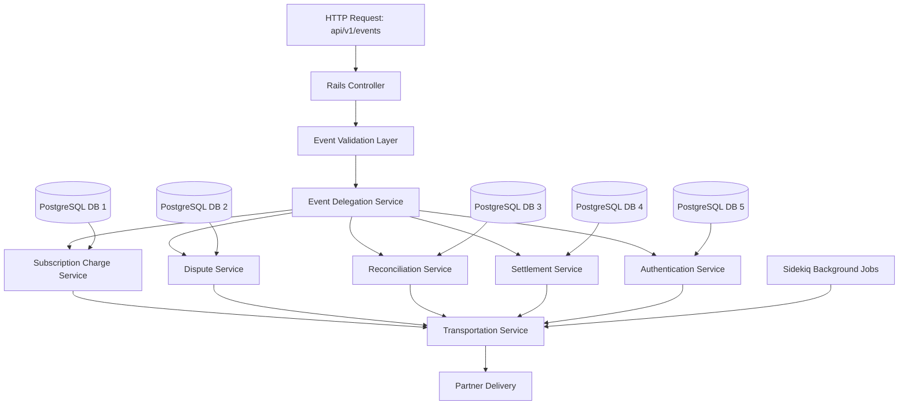
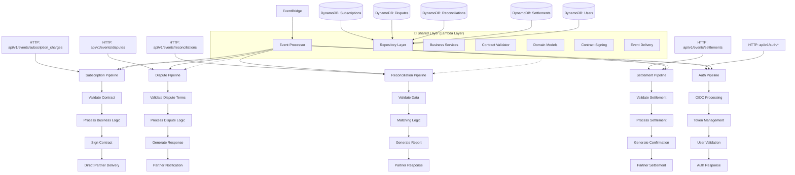

# ADR-001: Migration from Modular Monolith to Serverless Pipeline Architecture

## Status
**Proposed** - Under Review

## Date
2025-01-16

## Context

### Current State: PINET Core (Old Architecture)

PINET Core implements a **multi-layered architecture** combining several architectural styles:

#### **Architecture Styles Applied:**

1. **Domain Driven Design (DDD)**
   - Business logic organized around domain concepts (Authentication, Subscription Charges, Disputes, etc.)
   - Domain models encapsulate business rules and invariants
   - Clear separation between domain logic and infrastructure concerns

2. **Model-View-Controller (MVC) - Rails Pattern**
   - Controllers handle HTTP requests and coordinate between layers
   - Models represent domain entities and business logic
   - Views handle presentation (API responses)

3. **Event-Driven Architecture**
   - Asynchronous processing via Sidekiq background jobs
   - Event publishing and subscription within the monolith
   - Event-based communication between modules

4. **Layered Architecture (CLEAN Architecture)**
   - **Presentation Layer**: Rails controllers and API endpoints
   - **Application Layer**: Service objects and use cases
   - **Domain Layer**: Business entities and domain services
   - **Infrastructure Layer**: Database access, external APIs

#### **System Structure:**

- **Framework**: Ruby on Rails 7 with Packwerk for modularity
- **Central Event Processing**: Single endpoint `api/v1/events` with delegation pattern
- **Database Strategy**: Multi-database setup with PostgreSQL
- **Event System**: In-process pub/sub with Sidekiq for background jobs
- **Deployment**: Traditional server-based deployment with containers

#### **Business Components:**
1. **Authentication**: Custom OIDC layer for user authentication
2. **Subscription Charge**: Transaction contract processing and transmission
3. **Dispute**: Dispute contract processing through the network
4. **Reconciliation**: Partner data reconciliation via contracts and events
5. **Settlement**: Partner settlement processing through contracts and events

#### **Processing Flow (Layered Delegation):**
```
HTTP Request → api/v1/events
    ↓
[Receive Event Layer]
    ↓
[Validate Event Layer]
    ↓
[Delegate to Processor Layer]
    ↓
[Business Logic Processing]
    ↓
[Generate Outgoing Event]
    ↓
[Transportation Component] → External Partners
```

### Target State: Moneta Core (New Architecture)

Moneta Core implements a **pipeline-oriented serverless architecture** with multiple architectural styles:

#### **Architecture Styles Applied:**

1. **Service-Oriented Architecture (SOA) - Serverless FaaS**
   - Each business function implemented as independent Lambda functions
   - Functions expose well-defined interfaces via API Gateway
   - Loose coupling between services through event-driven communication

2. **Microservices Architecture**
   - Each business domain (Authentication, Subscription, Dispute, etc.) as separate services
   - Independent deployment and scaling per service
   - Service-specific data stores and business logic

3. **Event-Driven Architecture**
   - AWS EventBridge for inter-service communication
   - Event streaming with SNS/SQS for asynchronous processing
   - Event sourcing patterns for audit trails

4. **Pipeline Architecture (Pipe-and-Filter)**
   - Dedicated processing pipelines for each business function
   - Each pipeline as an end-to-end processing chain
   - Filters for validation, transformation, and business logic
   - Direct partner integration without cross-component dependencies

#### **System Structure:**

- **Framework**: AWS Lambda with Python 3.9
- **Pipeline-per-Domain**: Dedicated endpoints and processing chains
- **Database Strategy**: DynamoDB with single-table design patterns
- **Event System**: AWS EventBridge, SNS, SQS for inter-service communication
- **Deployment**: Infrastructure as Code using AWS SAM

#### **Business Pipeline Architecture:**

1. **Authentication Pipeline**: `api/v1/auth/*`
   - OIDC authentication flow
   - User management and token validation

2. **Subscription Charge Pipeline**: `api/v1/events/subscription_charges`
   ```
   Event Input → Validate Contract → Sign Contract → Direct Partner Delivery
   ```

3. **Dispute Pipeline**: `api/v1/events/disputes`
   ```
   Dispute Event → Validate Terms → Process Dispute → Partner Notification
   ```

4. **Reconciliation Pipeline**: `api/v1/events/reconciliations`
   ```
   Reconciliation Request → Data Validation → Matching Logic → Partner Response
   ```

5. **Settlement Pipeline**: `api/v1/events/settlements`
   ```
   Settlement Event → Contract Validation → Processing → Partner Settlement
   ```

#### **Processing Flow (End-to-End Pipelines):**
```
HTTP Request → api/v1/events/{domain}
    ↓
[Domain-Specific Lambda Function] ← Shared Layer Components
    ↓
[Validate Contract] → [Process Business Logic] → [Direct Partner Integration]
    ↓
[Response/Event Publishing]
```

#### **Shared Layer Architecture:**

The new architecture implements a **shared layer strategy** that balances code reuse with pipeline flexibility:

```
shared/
├── domain/              # Domain Models (Database Record Wrappers ONLY)
│   ├── mpass_model.py           # Pure data structures
│   ├── organization_model.py    # No business logic
│   ├── publisher_model.py       # Just data representation
│   └── enum.py
├── repositories/        # Data Access Patterns (CRUD Operations ONLY)
│   ├── mpass_repository.py      # Generic database operations
│   ├── organization_repository.py
│   └── repositories.py
├── services/           # Infrastructure Services (NOT Business Logic)
│   ├── crypto_service.py                   # Generic cryptographic operations
│   ├── partner_communication_service.py    # Generic partner HTTP communication
│   ├── certificate_service.py              # Generic certificate management
│   └── base_service.py
├── common/             # Shared Infrastructure Components
│   ├── input_validator.py       # Generic JSON/schema validation
│   ├── event_transformer.py     # Generic event format conversion
│   └── dynamo_client.py         # Generic DynamoDB operations
└── utilities/          # Cross-Pipeline Utilities
    ├── validators.py            # Generic validation utilities
    ├── env_config.py           # Environment configuration
    └── logging_utils.py         # Standardized logging
```

**Infrastructure Components Available to All Pipelines:**
- **CryptoService**: Generic cryptographic operations and signature verification (not business rules)
- **PartnerCommunicationService**: Generic HTTP communication with external partners (not domain logic)
- **CertificateService**: Generic certificate management, loading, and key extraction (not business validation)
- **InputValidator**: Generic JSON/schema validation (not business validation)
- **Domain Models**: Pure data structure representations (no business methods)
- **Repository Layer**: Generic CRUD operations (not business queries)
- **Utilities**: Environment config, logging, generic validators

### Business Drivers

1. **Scalability Requirements**: Need to handle variable workloads with automatic scaling
2. **Cost Optimization**: Pay-per-use model for sporadic usage patterns
3. **Operational Overhead**: Reduce infrastructure management and maintenance
4. **Time-to-Market**: Faster deployment cycles and feature delivery
5. **Resilience**: Built-in fault tolerance and disaster recovery
6. **Global Reach**: Multi-region deployment capabilities

## Decision

**We will migrate from the Ruby on Rails modular monolith architecture to a serverless pipeline architecture using AWS Lambda and managed services.**

This migration will be executed in phases:

1. **Phase 1**: Core authentication services (auth-service)
2. **Phase 2**: Organization and membership management
3. **Phase 3**: Event processing and pipeline orchestration
4. **Phase 4**: Legacy system decommissioning

## Rationale

### Technical Advantages

#### 1. **Pipeline Architecture Benefits**
- **End-to-End Processing**: Each business domain has dedicated processing pipeline without cross-dependencies
- **Filter Composition**: Pipe-and-filter pattern allows flexible composition of processing stages
- **Parallel Processing**: Multiple pipelines can process different domains simultaneously
- **Resource Optimization**: Each pipeline function gets exactly the resources it needs

#### 2. **Microservices & SOA Advantages**
- **Domain Isolation**: Each business function (Authentication, Subscription, Dispute, etc.) runs independently
- **Independent Scaling**: Auto-scaling from 0 to thousands of concurrent executions per domain
- **Technology Flexibility**: Each service can use optimal technology stack for its domain
- **Team Autonomy**: Independent deployment and development cycles per business domain

#### 3. **Event-Driven Architecture Enhancement**
- **Domain-Specific Events**: EventBridge routing based on business domain rather than technical delegation
- **Direct Integration**: Events flow directly to appropriate pipelines without central processing
- **Event Sourcing**: Complete audit trail of all business events per domain
- **Asynchronous Processing**: SNS/SQS for reliable event delivery and retry mechanisms

#### 4. **Serverless FaaS Benefits**
- **Cold Start Mitigation**: Modern Lambda runtime optimizations reduce cold start impact
- **Stateless Design**: Pure functions with no shared state between invocations
- **Automatic Scaling**: Functions scale independently based on domain-specific load patterns
- **Cost Efficiency**: Pay only for actual processing time per business function

#### 5. **Infrastructure as Code (IaC)**
- **Pipeline-as-Code**: Each business pipeline defined as infrastructure
- **Reproducible Deployments**: SAM templates ensure consistent environments per domain
- **Version Control**: Infrastructure changes tracked alongside domain-specific code
- **Independent Rollbacks**: Rollback individual pipelines without affecting others

#### 6. **Developer Experience Enhancement**
- **Domain-Focused Development**: Developers can focus on single business domain
- **Local Pipeline Testing**: SAM CLI provides local testing capabilities per pipeline
- **CI/CD Per Domain**: Independent deployment pipelines for each business function
- **Distributed Observability**: CloudWatch + X-Ray tracing per pipeline with domain-specific metrics

### Operational Benefits

#### 1. **Cost Efficiency**
```
Modular Monolith Costs:
- Always-on servers: $500-2000/month baseline
- Database servers: $200-800/month
- Load balancers: $20-50/month
- Maintenance overhead: 20-30% development time

Serverless Pipeline Costs:
- Lambda execution: Pay per 100ms increments
- DynamoDB: Pay per read/write capacity units
- API Gateway: Pay per API call
- Estimated 40-60% cost reduction for typical workloads
```

#### 2. **Operational Overhead Reduction**
- **No Server Management**: AWS manages underlying infrastructure
- **Automatic Patching**: Runtime updates handled by AWS
- **Built-in Monitoring**: CloudWatch integration out-of-the-box
- **Security**: AWS security model with IAM and VPC integration

#### 3. **Deployment & Delivery**
- **Independent Deployments**: Each service can be deployed independently
- **Faster Iterations**: Smaller deployment units enable faster feedback cycles
- **Canary Deployments**: Built-in support for gradual rollouts

### Architectural Comparison

| Aspect | Multi-Layered Monolith (Old) | Pipeline-Oriented Serverless (New) |
|--------|-------------------------------|-------------------------------------|
| **Primary Patterns** | DDD + MVC + Layered + Event-Driven | SOA + Microservices + Pipeline + Event-Driven |
| **Processing Model** | Central delegation with layered processing | Domain-specific end-to-end pipelines |
| **Business Logic Organization** | Domain services within monolith layers | Independent pipeline functions per domain |
| **Deployment Unit** | Single Rails application | Individual Lambda functions per pipeline |
| **Scaling** | Vertical/horizontal server scaling | Automatic function-level scaling per pipeline |
| **Data Storage** | PostgreSQL with multiple DBs | DynamoDB with domain-optimized tables |
| **Event Processing** | Sidekiq background jobs + in-process delegation | EventBridge + SNS/SQS + direct integration |
| **Request Flow** | `api/v1/events` → delegate → process → transport | `api/v1/events/{domain}` → pipeline → direct delivery |
| **Cross-Domain Dependencies** | Shared transportation layer | Independent pipelines with minimal coupling |
| **Local Development** | `rails server` + dependencies | `sam local` + Docker per service |
| **State Management** | In-memory + database transactions | Stateless functions + DynamoDB |
| **Inter-service Communication** | In-process method calls + shared DB | API Gateway + Event-driven messaging |
| **Monitoring** | Application-level logging | CloudWatch + X-Ray distributed tracing per pipeline |
| **Contract Processing** | Centralized validation and delegation | Pipeline-specific contract handling |

### Shared Layer Implementation Strategy

#### **Design Principles for Shared Components**

The shared layer follows specific rules and conventions to maintain the balance between code reuse and pipeline flexibility:

##### **1. Three-Tier Shared Architecture**

```python
# Domain Layer - Database Record Wrappers
class MPassModel(BaseDynamoModel):
    """Pure data model representing mPass database record"""
    mPassId: str
    status: MPassStatus
    tier: MPassTier
    # No business logic - only data structure and validation

# Repository Layer - Data Access Collections  
class MPassRepository(BaseRepository):
    """Manages mPass database operations and queries"""
    def get_by_id(self, mpass_id: str) -> Optional[MPassModel]:
        # Standardized query patterns
    
    def save(self, mpass: MPassModel) -> MPassModel:
        # Standardized persistence operations

# Service Layer - Infrastructure Services (Generic Operations)
class CryptoService(BaseService):
    """Generic cryptographic operations across pipelines"""
    def verify_digital_signature(self, data: dict, certificate: Certificate) -> bool:
        # Generic signature verification - no business logic
    
    def extract_public_key(self, certificate: Certificate) -> str:
        # Generic cryptographic operations shared across domains
```

##### **2. Shared Component Rules & Conventions**

**Rule 1: Domain Models (shared/domain/)**
- **Purpose**: Represent database records as Python objects
- **Convention**: Models are pure data structures with validation only
- **Flexibility**: Each pipeline can extend models with domain-specific methods
- **Example Usage**:
```python
# In subscription_charge_pipeline.py
from shared.domain.mpass_model import MPassModel
from shared.domain.organization_model import OrganizationModel

def process_subscription(event):
    mpass = MPassModel(**event['mpass_data'])
    organization = OrganizationModel(**event['org_data'])
    # Pipeline-specific logic here
```

**Rule 2: Repository Layer (shared/repositories/)**
- **Purpose**: Standardize database access patterns and queries
- **Convention**: One repository per domain model, consistent interface
- **Flexibility**: Pipelines can inject custom query logic while maintaining base patterns
- **Example Usage**:
```python
# In dispute_pipeline.py
from shared.repositories.mpass_repository import MPassRepository

def handle_dispute(event):
    mpass_repo = MPassRepository()
    mpass = mpass_repo.get_by_id(event['mpass_id'])
    # Dispute-specific processing logic
    mpass_repo.save(updated_mpass)
```

**Rule 3: Shared Services (shared/services/)**
- **Purpose**: Provide infrastructure and utility services (NOT business logic)
- **Convention**: Services are stateless, generic, and infrastructure-focused
- **Flexibility**: Pipelines use shared utilities but implement their own business logic
- **What Goes in Shared Services**:
```python
# shared/services/crypto_service.py ✅ SHARED INFRASTRUCTURE
class CryptoService:
    def verify_digital_signature(self, data: dict, certificate: Certificate) -> bool:
        """Generic RSA signature verification - works for ANY data type"""
        # Only verifies cryptographic signature, no business validation
        return self._verify_rsa_signature(data, certificate)

# shared/services/partner_communication_service.py ✅ SHARED INFRASTRUCTURE  
class PartnerCommunicationService:
    def send_to_partner(self, payload: dict, endpoint_config: dict) -> bool:
        """Generic partner HTTP delivery - works for ANY payload type"""
        # Generic HTTP/messaging, no business logic
        return self._send_http_request(payload, endpoint_config)
```

**How Pipelines Use Shared Services**:
```python
# settlement_pipeline/settlement_handler.py ❌ PIPELINE CODE (NOT in shared)
from shared.services.crypto_service import CryptoService
from shared.services.certificate_service import CertificateService
from shared.services.partner_communication_service import PartnerCommunicationService

def process_settlement(event):
    # ✅ Use shared infrastructure services
    crypto_service = CryptoService()
    certificate_service = CertificateService()
    
    # Step 1: ✅ Use shared certificate service for certificate operations
    publisher_cert = certificate_service.get_active_certificate(event['publisher_id'], 'api')
    if not crypto_service.verify_digital_signature(event, publisher_cert):
        raise InvalidSignatureError("Contract signature is invalid")
    
    # Step 2: ❌ Business validation stays IN THE PIPELINE - NOT shared
    validated_contract = verify_contract(event, settlement_rules)
    
    # Step 3: ❌ Contract signing stays IN THE PIPELINE - NOT shared  
    signed_contract = sign_contract(validated_contract, settlement_signing_rules)
    
    # Step 4: ✅ Use shared infrastructure service for delivery
    communication_service = PartnerCommunicationService()
    communication_service.send_to_partner(signed_contract, partner_config)

def verify_contract(event, settlement_rules):
    """❌ PIPELINE-SPECIFIC: Business rules, template validation, etc."""
    # Settlement-specific business validation:
    # - Minimum settlement amounts
    # - Authorized parties
    # - Contract template compliance
    # - Settlement timeframes
    pass

def sign_contract(contract, settlement_signing_rules):
    """❌ PIPELINE-SPECIFIC: Settlement-specific signing logic"""
    # Settlement-specific signing requirements:
    # - Settlement authority signatures
    # - Settlement-specific crypto algorithms
    # - Settlement compliance stamps
    pass
```

##### **3. AWS SAM Layer Integration**

```yaml
# SAM template for shared layer deployment
SharedLayer:
  Type: AWS::Serverless::LayerVersion
  Properties:
    LayerName: moneta-shared-layer
    Description: Shared components for all pipelines
    ContentUri: shared/
    CompatibleRuntimes:
      - python3.9
    RetentionPolicy: Retain

# Pipeline functions reference the shared layer
SubscriptionChargeFunction:
  Type: AWS::Serverless::Function
  Properties:
    Handler: subscription_charge.lambda_handler
    Layers:
      - !Ref SharedLayer
    Environment:
      Variables:
        SHARED_LAYER_PATH: /opt/python
```

##### **4. Balance Strategy: Reuse vs. Flexibility**

**Code Reuse Mechanisms:**
- **Inheritance**: Base classes for common patterns
- **Composition**: Injectable services and utilities
- **Configuration**: Environment-driven behavior adaptation

**Flexibility Preservation:**
- **Interface Contracts**: Well-defined APIs with implementation freedom
- **Extension Points**: Hook methods for pipeline-specific logic
- **Override Capabilities**: Ability to replace shared components when needed

**Example: Flexible Contract Validation**
```python
# Shared base with extensibility
class BaseContractValidator:
    def validate(self, contract: dict) -> ValidationResult:
        # Common validation logic
        result = self._validate_structure(contract)
        result.update(self._validate_business_rules(contract))
        return result
    
    def _validate_business_rules(self, contract: dict) -> ValidationResult:
        # Extension point for pipeline-specific rules
        return ValidationResult(valid=True)

# Pipeline-specific extension
class SubscriptionContractValidator(BaseContractValidator):
    def _validate_business_rules(self, contract: dict) -> ValidationResult:
        # Subscription-specific validation logic
        return self._validate_subscription_limits(contract)
```

##### **5. Shared Layer DO's and DON'Ts**

#### **✅ DO: Put in Shared Layer**

**Infrastructure & Utilities:**
```python
# ✅ Generic cryptographic operations (infrastructure)
class CryptoService:
    def verify_digital_signature(self, data: dict, certificate: Certificate) -> bool:
        # Generic signature verification - Single Responsibility Principle
        # ONLY verifies crypto signature, no business validation

# ✅ Generic certificate management (infrastructure)
class CertificateService:
    def get_active_certificate(self, entity_id: str, certificate_type: str) -> Certificate:
        # Generic certificate lookup and rotation handling
    def extract_public_key(self, certificate: Certificate) -> str:
        # Pure certificate operations - no business logic

# ✅ Generic partner communication (infrastructure)  
class PartnerCommunicationService:
    def send_to_partner(self, payload: dict, endpoint_config: dict) -> bool:
        # Generic HTTP communication - reusable

# ✅ Generic input validation (utility)
class InputValidator:
    def validate_json_structure(self, data: dict, schema: dict) -> bool:
        # Generic JSON validation - reusable
```

**Data Access Patterns:**
```python
# ✅ Domain models (data structure)
class MPassModel(BaseDynamoModel):
    mPassId: str
    status: MPassStatus  # Pure data representation

# ✅ Repository patterns (data access)
class MPassRepository(BaseRepository):
    def get_by_id(self, mpass_id: str) -> Optional[MPassModel]:
        # Generic CRUD operations - reusable
```

#### **❌ DON'T: Put in Shared Layer**

**Business Logic Specific to One Domain:**
```python
# ❌ Settlement-specific contract verification (business rules + templates)
def verify_contract(event, settlement_rules):
    # This belongs ONLY in settlement_pipeline - don't share!
    # - Minimum settlement amounts
    # - Authorized parties validation  
    # - Settlement template compliance
    # - Settlement timeframes

# ❌ Dispute-specific contract verification (business rules + templates)
def verify_contract(event, dispute_rules):
    # This belongs ONLY in dispute_pipeline - don't share!
    # - Dispute evidence requirements
    # - Dispute timeframe validation
    # - Dispute template compliance
    # - Resolution criteria

# ❌ Subscription-specific contract verification (business rules + templates)
def verify_contract(event, subscription_rules):
    # This belongs ONLY in subscription_pipeline - don't share!
    # - Subscription tier validation
    # - Payment rules compliance
    # - Subscription template validation
    # - Terms and conditions
```

**Pipeline-Specific Workflows:**
```python
# ❌ Each pipeline has its own verify_contract with different rules
# settlement_pipeline/verify_contract.py
def verify_contract(event, settlement_rules):
    # Settlement-specific contract rules - don't pollute other pipelines!
    # e.g., minimum settlement amount, authorized parties, etc.

# dispute_pipeline/verify_contract.py  
def verify_contract(event, dispute_rules):
    # Dispute-specific contract rules - different from settlement rules!
    # e.g., dispute timeframes, evidence requirements, etc.

# subscription_pipeline/verify_contract.py
def verify_contract(event, subscription_rules):
    # Subscription-specific contract rules - unique business logic!
    # e.g., subscription tiers, payment validation, etc.
```

#### **📋 Quick Decision Matrix**

| Component Type | Shared Layer? | Where It Belongs |
|---------------|---------------|------------------|
| Digital signature verification (crypto) | ✅ YES | `shared/services/crypto_service.py` |
| Certificate management (loading, validation, key extraction) | ✅ YES | `shared/services/certificate_service.py` |
| Partner HTTP communication | ✅ YES | `shared/services/partner_communication_service.py` |
| Domain models (data structures) | ✅ YES | `shared/domain/` |
| Database repositories | ✅ YES | `shared/repositories/` |
| Contract signing | ❌ NO | `{pipeline}/sign_contract.py` |
| Contract verification (business rules) | ❌ NO | `{pipeline}/verify_contract.py` |
| Contract template validation | ❌ NO | `{pipeline}/verify_contract.py` |
| Settlement contract signing | ❌ NO | `settlement_pipeline/sign_contract.py` |
| Settlement contract verification | ❌ NO | `settlement_pipeline/verify_contract.py` |
| Dispute contract signing | ❌ NO | `dispute_pipeline/sign_contract.py` |
| Dispute contract verification | ❌ NO | `dispute_pipeline/verify_contract.py` |
| Subscription contract signing | ❌ NO | `subscription_pipeline/sign_contract.py` |
| Subscription contract verification | ❌ NO | `subscription_pipeline/verify_contract.py` |
| Pipeline workflows | ❌ NO | Individual pipeline modules |

#### **🚨 CRITICAL: Naming Convention Rules (MUST BE FOLLOWED)**

**The filename, module name, and class name MUST REFLECT THE CONTENT. NO EXCEPTIONS.**

**✅ CORRECT Naming Examples:**
```python
# ✅ Generic infrastructure services - use GENERIC names
shared/services/crypto_service.py           → class CryptoService
shared/services/certificate_service.py      → class CertificateService  
shared/services/partner_communication_service.py → class PartnerCommunicationService
shared/utilities/validators.py              → class JsonValidator
shared/utilities/env_config.py              → class ConfigManager

# ✅ Pipeline-specific services - use DOMAIN-SPECIFIC names
subscription_pipeline/subscription_service.py → class SubscriptionService
dispute_pipeline/dispute_service.py         → class DisputeService
settlement_pipeline/settlement_service.py   → class SettlementService
```

**❌ WRONG Naming Examples (NEVER DO THIS):**
```python
# ❌ MISLEADING: Service name suggests subscription-specific but contains generic crypto
shared/services/subscription_certificate_service.py → class SubscriptionCertificateService:
    def verify_rsa_signature(self, data: dict) -> bool:  # Generic function!
        # This is GENERIC crypto, not subscription-specific!

# ❌ MISLEADING: Service name suggests dispute-specific but contains generic HTTP
shared/services/dispute_delivery_service.py → class DisputeDeliveryService:
    def send_http_request(self, url: str, payload: dict) -> bool:  # Generic function!
        # This is GENERIC HTTP, not dispute-specific!

# ❌ MISLEADING: Service name suggests generic but contains business logic
shared/services/crypto_service.py → class CryptoService:
    def validate_subscription_contract(self, contract: dict) -> bool:  # Business logic!
        # This is SUBSCRIPTION BUSINESS LOGIC, not generic crypto!
```

**📏 Naming Rules:**
1. **Shared services MUST use generic names**: `CryptoService`, `CertificateService`, `DatabaseService`
2. **Pipeline services MUST use domain-specific names**: `SubscriptionService`, `DisputeService`
3. **Function names MUST match service scope**: Generic services = generic functions, Domain services = domain functions
4. **File names MUST match class names**: `crypto_service.py` → `CryptoService`
5. **No misleading combinations**: Never mix generic names with domain logic or vice versa

**🔍 Content Validation Rule:**
- If the function content is **generic infrastructure** → Service MUST have **generic name**
- If the function content is **domain-specific business logic** → Service MUST have **domain-specific name**
- The content determines the correct naming, not the intended usage

#### **🎯 Implementation Guidelines**

**For Pipeline Developers:**
1. **Keep business logic in your pipeline** - don't pollute shared layer
2. **Use shared infrastructure services** for common operations (certificate management, crypto, communication)
3. **Use shared domain models** for data consistency
4. **Use shared repositories** for database operations
5. **Contribute generic utilities only** to shared layer
6. **Follow naming conventions religiously** - misnamed components will be rejected

**For Shared Layer Maintainers:**
1. **Only accept infrastructure and utilities** - reject business logic
2. **Keep interfaces generic and reusable** across all domains
3. **Provide clear extension points** for customization
4. **Document what belongs in shared vs pipeline** 
5. **Version shared components** for backward compatibility
6. **Enforce naming conventions** - reject any misnamed submissions
7. **Review function content, not just service names** - ensure content matches naming

### Architectural Style Application Comparison

#### **Old Architecture: How Styles Are Applied**

1. **Domain Driven Design (DDD)**
   ```ruby
   # Domain models encapsulate business rules
   class SubscriptionCharge < ApplicationRecord
     validates :amount, :currency, presence: true
     
     def process_charge
       # Domain logic for charge processing
     end
   end
   
   # Domain services handle complex business operations
   class SubscriptionChargeService
     def process_transaction_contract(contract)
       # Business logic implementation
     end
   end
   ```

2. **MVC Pattern Implementation**
   ```ruby
   # Controller handles HTTP requests and orchestration
   class Api::V1::EventsController < ApplicationController
     def create
       event = IncomingEvent.create!(event_params)
       EventProcessorService.delegate(event)
       render json: { status: 'accepted' }
     end
   end
   ```

3. **Layered Architecture (CLEAN)**
   ```
   ┌─────────────────────────────────────┐
   │     Presentation Layer              │ ← Controllers, API endpoints
   │  (Rails Controllers & Views)        │
   ├─────────────────────────────────────┤
   │     Application Layer               │ ← Service objects, Use cases
   │  (Service Classes & Orchestration)  │
   ├─────────────────────────────────────┤
   │     Domain Layer                    │ ← Business entities, Domain services
   │  (Models, Domain Services)          │
   ├─────────────────────────────────────┤
   │     Infrastructure Layer            │ ← Database, External APIs
   │  (ActiveRecord, HTTP clients)       │
   └─────────────────────────────────────┘
   ```

4. **Central Event Processing Flow**
   ```ruby
   # Single entry point with delegation
   class EventProcessorService
     def self.delegate(event)
       case event.event_type
       when 'subscription_charge'
         SubscriptionChargeService.process(event)
       when 'dispute'
         DisputeService.process(event)
       # ... other delegations
       end
       
       TransportationService.deliver_outgoing_events
     end
   end
   ```

#### **New Architecture: How Styles Are Applied**

1. **Service-Oriented Architecture (SOA) with Serverless FaaS**
   ```python
   # Each business function as independent Lambda
   # subscription_charge_handler.py
   def lambda_handler(event, context):
       """Dedicated handler for subscription charges"""
       contract = validate_subscription_contract(event)
       signed_contract = sign_contract(contract)
       deliver_to_partner(signed_contract)
       return {"statusCode": 200}
   ```

2. **Microservices Architecture**
   ```yaml
   # Each domain gets its own infrastructure
   SubscriptionChargeService:
     Type: AWS::Serverless::Function
     Properties:
       Handler: subscription_charge.lambda_handler
       Environment:
         Variables:
           SUBSCRIPTION_TABLE: !Ref SubscriptionTable
   
   DisputeService:
     Type: AWS::Serverless::Function
     Properties:
       Handler: dispute.lambda_handler
       Environment:
         Variables:
           DISPUTE_TABLE: !Ref DisputeTable
   ```

3. **Pipeline Architecture (Pipe-and-Filter)**
   ```python
   # End-to-end pipeline for subscription charges
   def subscription_charge_pipeline(event):
       """Pipe-and-filter pattern implementation"""
       # Filter 1: Input validation
       validated_event = validate_input(event)
       
       # Filter 2: Contract processing
       contract = process_contract(validated_event)
       
       # Filter 3: Digital signing
       signed_contract = apply_digital_signature(contract)
       
       # Filter 4: Partner delivery
       delivery_result = deliver_to_partner(signed_contract)
       
       # Filter 5: Audit logging
       log_transaction(delivery_result)
       
       return delivery_result
   ```

4. **Domain-Specific Pipeline Routing**
   ```yaml
   # API Gateway routes directly to domain pipelines
   Events:
     /api/v1/events/subscription_charges:
       post:
         x-amazon-apigateway-integration:
           httpMethod: POST
           type: aws_proxy
           uri: !Sub "arn:aws:lambda:${AWS::Region}:${AWS::AccountId}:function:SubscriptionChargeFunction"
   
     /api/v1/events/disputes:
       post:
         x-amazon-apigateway-integration:
           httpMethod: POST
           type: aws_proxy
           uri: !Sub "arn:aws:lambda:${AWS::Region}:${AWS::AccountId}:function:DisputeFunction"
   ```

### Migration Strategy Benefits

#### 1. **From Centralized Delegation to Pipeline Specialization**
- **Old**: Single `api/v1/events` endpoint with internal routing and shared transportation
- **New**: Domain-specific endpoints with end-to-end processing pipelines
- **Benefit**: Eliminates cross-domain dependencies and reduces processing latency

#### 2. **Domain-Driven Design Evolution**
- **Preservation**: Business domain concepts remain intact across architectures
- **Enhancement**: Each domain gets dedicated infrastructure and independent scaling
- **Benefit**: True domain isolation with bounded contexts

#### 3. **Pipeline Pattern Advantages**
- **Scalability**: Each pipeline stage can scale independently
- **Maintainability**: Clear separation of concerns within each pipeline
- **Testability**: Each filter/stage can be tested in isolation
- **Performance**: Direct processing without delegation overhead

#### 4. **Technology Stack Modernization**
- Python 3.9 with modern libraries (Pydantic, Boto3)
- Type hints and better tooling ecosystem
- AWS-native development patterns

## Consequences

### Positive Outcomes

1. **Improved Scalability**
   - Automatic scaling from 0 to thousands of concurrent executions
   - No capacity planning required
   - Better handling of traffic spikes

2. **Cost Optimization**
   - Pay-per-use pricing model
   - No idle resource costs
   - Reduced operational overhead

3. **Faster Development Cycles**
   - Independent service deployments
   - Smaller, focused codebases
   - Parallel development streams

4. **Enhanced Reliability**
   - Built-in fault tolerance
   - Multi-AZ deployments by default
   - Automatic retry mechanisms

5. **Better Observability**
   - Distributed tracing with X-Ray
   - Centralized logging with CloudWatch
   - Rich metrics and alarms

### Negative Consequences & Mitigations

1. **Complexity Increase**
   - **Challenge**: More distributed components to manage
   - **Mitigation**: Comprehensive documentation, ADRs, and standardized patterns

2. **Cold Start Latency**
   - **Challenge**: Initial function invocation delays
   - **Mitigation**: Provisioned concurrency for critical paths, function warming strategies

3. **Local Development Complexity**
   - **Challenge**: Testing distributed systems locally
   - **Mitigation**: SAM CLI, LocalStack, comprehensive unit testing

4. **Vendor Lock-in**
   - **Challenge**: AWS-specific services and patterns
   - **Mitigation**: Abstraction layers, adherence to standard patterns, exit strategy documentation

5. **Learning Curve**
   - **Challenge**: Team needs to learn serverless patterns and AWS services
   - **Mitigation**: Training programs, pair programming, gradual migration approach

### Risk Assessment & Mitigation

| Risk | Impact | Probability | Mitigation Strategy |
|------|---------|-------------|-------------------|
| Cold start performance issues | Medium | Medium | Provisioned concurrency, function optimization |
| Debugging complexity | Medium | High | Comprehensive logging, X-Ray tracing, local dev tools |
| AWS service limits | High | Low | Monitor quotas, request limit increases proactively |
| Team knowledge gap | Medium | High | Training program, documentation, mentoring |
| Data migration complexity | High | Medium | Phased migration, data validation, rollback procedures |

## Pipeline Structure Standards

Each pipeline in the new architecture follows a standardized directory structure based on the established `auth-service` pattern. This consistency ensures maintainability, discoverability, and ease of onboarding across all business domain pipelines.

### Standard Pipeline Directory Structure

```
{pipeline-name}/                    # e.g., subscription-charge-pipeline/
├── scripts/                       # Pipeline-specific automation scripts
│   ├── generate_test_data.py      # Test data generation for the pipeline
│   ├── seed_data.py               # Initial data seeding scripts
│   ├── migrate_data.py            # Data migration utilities
│   └── run_integration_tests.sh   # Pipeline testing automation
├── src/                           # Source code for the pipeline
│   ├── copy_shared.sh             # Script to copy shared layer components
│   ├── Makefile                   # Build and deployment automation
│   ├── handlers/                  # Lambda function handlers
│   │   ├── {FunctionName}/        # Must follow AWS SAM naming convention
│   │   │   └── handler.py         # Entry point: lambda_handler(event, context)
│   ├── models/                    # Pipeline-specific domain models
│   │   ├── request_models.py      # API request/input models (Pydantic)
│   │   ├── response_models.py     # API response/output models (Pydantic)
│   │   └── {domain}_models.py     # Business domain-specific models
│   └── services/                  # Pipeline business logic services
│       ├── business_logic_service.py  # Core business logic for this domain
│       └── integration_service.py # External integration logic
├── tests/                         # All pipeline tests
│   ├── requirements.txt           # Test-specific dependencies
│   ├── unit/                      # Unit tests (isolated, mocked)
│   │   ├── handlers/              # Handler unit tests
│   │   │   └── test_{function_name}_handler.py
│   │   ├── models/                # Model validation tests
│   │   │   └── test_{model_name}.py
│   │   ├── services/              # Service logic tests
│   │   │   └── test_{service_name}.py
│   │   └── repositories/          # Repository layer tests (if custom repos)
│   │       └── test_{repository_name}.py
│   └── integration/               # End-to-end and integration tests
│       ├── __init__.py
│       ├── test_pipeline_flow.py  # Full pipeline integration tests
│       └── test_external_integrations.py  # Partner API integration tests
├── README.md                      # Pipeline overview and setup instructions
├── technical_design.md            # Detailed technical design document
├── requirements.txt               # Pipeline-specific Python dependencies
├── template.yaml                  # AWS SAM infrastructure definition
├── samconfig.toml                 # SAM deployment configuration
```

### Pipeline Structure Component Descriptions

#### **📁 scripts/ - Automation & Utilities**
```bash
scripts/
├── generate_test_data.py       # Creates realistic test data for pipeline testing
├── seed_data.py               # Seeds DynamoDB with initial data for development
├── migrate_data.py            # Handles data migration from legacy systems
├── run_integration_tests.sh   # Automated integration test execution
└── deploy_pipeline.sh         # Pipeline-specific deployment automation
```

**Purpose**: Pipeline-specific automation, data management, and testing utilities
**Convention**: All scripts should be idempotent and environment-aware
**Usage Example**:
```bash
# Generate test data for subscription pipeline
python scripts/generate_test_data.py --pipeline=subscription --count=100

# Seed development environment
python scripts/seed_data.py --env=dev --pipeline=subscription
```

#### **📁 src/ - Source Code**
```python
src/
├── copy_shared.sh              # Copies shared layer components locally for development
├── Makefile                    # Build, test, and deployment commands
├── handlers/                   # Lambda function entry points
├── models/                     # Pipeline-specific data models  
└── services/                   # Business logic services
```

**Purpose**: Contains all pipeline source code organized by responsibility
**Convention**: Clear separation between handlers (infrastructure), models (data), and services (business logic)

#### **📁 src/handlers/ - Lambda Function Handlers**
```python
# handlers/ValidateContractFunction/handler.py
def lambda_handler(event, context):
    """
    Entry point for contract validation Lambda function.
    
    Args:
        event: API Gateway event or EventBridge event
        context: Lambda runtime context
        
    Returns:
        dict: Standard Lambda response format
    """
    from shared.middleware.handler import handle_lambda_request
    from ..services.contract_service import ContractService
    
    @handle_lambda_request
    def process_request(parsed_event):
        contract_service = ContractService()
        return contract_service.validate_contract(parsed_event)
    
    return process_request(event, context)
```

**Purpose**: Thin handlers that delegate to business logic services
**Convention**: Must follow AWS SAM naming convention `{FunctionName}/handler.py`
**Responsibilities**:
- Event parsing and validation
- Error handling and response formatting
- Delegation to appropriate services
- Logging and monitoring

#### **📁 src/models/ - Pipeline Data Models**
```python
# models/request_models.py
from pydantic import BaseModel, Field
from typing import Optional
from shared.domain.enum import ContractType

class SubscriptionChargeRequest(BaseModel):
    """Request model for subscription charge processing"""
    contract_id: str = Field(..., description="Unique contract identifier")
    amount: float = Field(..., gt=0, description="Charge amount")
    currency: str = Field(..., regex="^[A-Z]{3}$", description="ISO currency code")
    mpass_id: str = Field(..., description="mPass identifier")
    organization_id: str = Field(..., description="Organization identifier")
    metadata: Optional[dict] = Field(default={}, description="Additional metadata")

# models/response_models.py
class SubscriptionChargeResponse(BaseModel):
    """Response model for subscription charge processing"""
    transaction_id: str
    status: str
    processed_at: str
    partner_confirmation: Optional[str] = None
```

**Purpose**: Define data structures for API requests/responses and internal data transfer
**Convention**: Use Pydantic models for validation and serialization
**Types**:
- `request_models.py`: API input validation models
- `response_models.py`: API output formatting models
- `{domain}_models.py`: Internal business models specific to the pipeline

#### **📁 src/services/ - Business Logic Services**
```python
# services/subscription_contract_service.py
from shared.services.crypto_service import CryptoService
from shared.services.certificate_service import CertificateService
from shared.repositories.mpass_repository import MPassRepository
from ..models.request_models import SubscriptionChargeRequest

class SubscriptionContractService:
    """Subscription-specific contract handling service"""
    
    def __init__(self):
        self.crypto_service = CryptoService()
        self.certificate_service = CertificateService()
        self.mpass_repo = MPassRepository()
    
    def validate_contract(self, request: SubscriptionChargeRequest) -> bool:
        """Pipeline-specific contract validation logic"""
        # Step 1: ✅ Use shared infrastructure for signature verification
        certificate = self.certificate_service.get_active_certificate(request.publisher_id, 'api')
        if not self.crypto_service.verify_digital_signature(request.dict(), certificate):
            raise InvalidSignatureError("Contract signature verification failed")
        
        # Step 2: ❌ Pipeline-specific business validation
        return self._validate_subscription_business_rules(request)
    
    def _validate_subscription_business_rules(self, request: SubscriptionChargeRequest) -> bool:
        """Subscription-specific business validation - NOT in shared layer"""
        # Subscription tier validation
        mpass = self.mpass_repo.get_by_id(request.mpass_id)
        if not mpass or mpass.status != "ACTIVE":
            raise InvalidMPassError(f"Invalid or inactive mPass: {request.mpass_id}")
        
        # Subscription amount limits based on tier
        if mpass.tier == "BRONZE" and request.amount > 100:
            raise BusinessValidationError("Bronze tier limit exceeded")
        elif mpass.tier == "SILVER" and request.amount > 500:
            raise BusinessValidationError("Silver tier limit exceeded")
        
        return True
```

**Purpose**: Implement pipeline-specific business logic and domain operations
**Convention**: Services coordinate between shared infrastructure and pipeline-specific rules
**Responsibilities**:
- Business rule validation and processing
- Orchestration of shared services
- Domain-specific logic implementation
- External system integration

#### **📁 tests/ - Testing Strategy**
```python
# tests/unit/handlers/test_validate_contract_handler.py
import pytest
from unittest.mock import Mock, patch
from src.handlers.ValidateContractFunction.handler import lambda_handler

class TestValidateContractHandler:
    def test_successful_validation(self):
        """Test successful contract validation flow"""
        event = {
            "body": json.dumps({
                "contract_id": "test-123",
                "amount": 50.0,
                "currency": "USD",
                "mpass_id": "mpass-456"
            })
        }
        
        with patch('src.services.contract_service.ContractService') as mock_service:
            mock_service.return_value.validate_contract.return_value = True
            
            response = lambda_handler(event, {})
            
            assert response["statusCode"] == 200

# tests/integration/test_pipeline_flow.py
class TestSubscriptionPipelineFlow:
    def test_end_to_end_subscription_processing(self):
        """Test complete subscription processing pipeline"""
        # Setup test data
        # Call API endpoint
        # Verify database changes
        # Verify partner delivery
        pass
```

**Purpose**: Comprehensive testing strategy for pipeline functionality
**Structure**:
- **Unit Tests**: Fast, isolated tests with mocked dependencies
- **Integration Tests**: End-to-end tests with real AWS services (LocalStack/test environment)

#### **📁 Required Files**

##### **README.md - Pipeline Overview**
```markdown
# Subscription Charge Pipeline

## Overview
Processes subscription charge contracts through the Moneta Network.

## Architecture
- **Handler**: ValidateContractFunction, ProcessChargeFunction, DeliverToPartnerFunction
- **Business Logic**: Contract validation, charge processing, partner integration
- **Data Models**: SubscriptionChargeRequest, SubscriptionChargeResponse

## Setup
```bash
# Install dependencies
pip install -r requirements.txt

# Deploy to development
sam deploy --config-env dev

# Run tests
pytest tests/
```

## API Endpoints
- `POST /api/v1/events/subscription_charges` - Process subscription charge

## Environment Variables
- `SUBSCRIPTION_TABLE_NAME` - DynamoDB table for subscription data
- `PARTNER_API_URL` - Partner integration endpoint
```

##### **technical_design.md - Detailed Technical Design**
```markdown
# Subscription Charge Pipeline - Technical Design

## Business Requirements
- Process subscription charges from partners
- Validate mPass eligibility and limits
- Apply business rules for different subscription tiers
- Deliver confirmed transactions to partners

## Technical Architecture

### Data Flow
1. API Gateway receives subscription charge request
2. ValidateContractFunction verifies signature and business rules
3. ProcessChargeFunction executes charge logic
4. DeliverToPartnerFunction sends confirmation to partner

### Business Rules
- Bronze tier: Maximum $100 per transaction
- Silver tier: Maximum $500 per transaction  
- Gold tier: No transaction limits
- Platinum tier: No transaction limits + priority processing

### Error Handling
- Invalid signature: Return 401 Unauthorized
- Business rule violation: Return 400 Bad Request with details
- Partner delivery failure: Retry with exponential backoff

### Security Considerations
- All requests must have valid digital signature
- mPass status validation required
- Partner authentication via API keys

### Performance Requirements
- Contract validation: < 200ms
- End-to-end processing: < 1000ms
- Partner delivery: < 500ms
```

##### **requirements.txt - Dependencies**
```txt
# Pipeline-specific dependencies
pydantic==1.10.7
requests==2.28.2
cryptography==3.4.8

# AWS SDK (if not using shared layer)
boto3==1.26.137
botocore==1.29.137

# Testing dependencies (in tests/requirements.txt)
pytest==7.3.1
pytest-mock==3.10.0
moto==4.1.11
```

##### **template.yaml - Infrastructure Definition**
```yaml
AWSTemplateFormatVersion: '2010-09-09'
Transform: AWS::Serverless-2016-10-31
Description: Subscription Charge Pipeline

Parameters:
  Environment:
    Type: String
    Default: dev
    AllowedValues: [dev, staging, prod]

Globals:
  Function:
    Runtime: python3.9
    Timeout: 30
    MemorySize: 512
    Layers:
      - !Ref SharedLayer
    Environment:
      Variables:
        ENVIRONMENT: !Ref Environment
        LOG_LEVEL: INFO

Resources:
  # Lambda Functions
  ValidateContractFunction:
    Type: AWS::Serverless::Function
    Properties:
      CodeUri: src/handlers/ValidateContractFunction/
      Handler: handler.lambda_handler
      Events:
        Api:
          Type: Api
          Properties:
            Path: /api/v1/events/subscription_charges
            Method: post

  # DynamoDB Tables
  SubscriptionTable:
    Type: AWS::DynamoDB::Table
    Properties:
      TableName: !Sub "${Environment}-subscription-charges"
      BillingMode: PAY_PER_REQUEST
      AttributeDefinitions:
        - AttributeName: contractId
          AttributeType: S
      KeySchema:
        - AttributeName: contractId
          KeyType: HASH

Outputs:
  ApiEndpoint:
    Description: API Gateway endpoint URL
    Value: !Sub "https://${ServerlessRestApi}.execute-api.${AWS::Region}.amazonaws.com/Prod"
  
  SubscriptionTableName:
    Description: DynamoDB table name
    Value: !Ref SubscriptionTable
    Export:
      Name: !Sub "${Environment}-SubscriptionTableName"
```

##### **samconfig.toml - Deployment Configuration**
```toml
version = 0.1

[default.deploy.parameters]
stack_name = "subscription-charge-pipeline"
s3_bucket = "moneta-sam-deployment-bucket"
s3_prefix = "subscription-charge-pipeline"
region = "us-east-1"
confirm_changeset = true
capabilities = "CAPABILITY_IAM"
parameter_overrides = "Environment=dev"

[staging.deploy.parameters]
stack_name = "subscription-charge-pipeline-staging"
parameter_overrides = "Environment=staging"

[prod.deploy.parameters]
stack_name = "subscription-charge-pipeline-prod"
parameter_overrides = "Environment=prod"
confirm_changeset = true
```

### Pipeline Development Workflow

#### **1. Create New Pipeline**
```bash
# Copy structure from auth-service template
cp -r auth-service/ subscription-charge-pipeline/

# Update pipeline-specific configurations
# - Update template.yaml with new function names
# - Update README.md with pipeline description
# - Update technical_design.md with business requirements
```

#### **2. Development Process**
```bash
# Install dependencies
pip install -r requirements.txt
pip install -r tests/requirements.txt

# Copy shared layer for local development
./src/copy_shared.sh

# Run local tests
pytest tests/unit/
pytest tests/integration/

# Test locally with SAM
sam local start-api

# Deploy to development environment
sam deploy --config-env dev
```

#### **3. Pipeline Conventions**

**Naming Conventions:**
- Pipeline directories: `{business-domain}-pipeline/` (e.g., `subscription-charge-pipeline/`)
- Lambda functions: `{Action}{Entity}Function` (e.g., `ValidateContractFunction`)
- Service classes: `{Domain}Service` (e.g., `ContractService`, `IntegrationService`)
- Model files: `{purpose}_models.py` (e.g., `request_models.py`, `response_models.py`)

**Code Organization:**
- **Handlers**: Thin layers focused on event handling and response formatting
- **Services**: Business logic specific to the pipeline domain
- **Models**: Data validation and transformation using Pydantic
- **Tests**: Comprehensive coverage with clear separation of unit vs integration tests

**Documentation Requirements:**
- Every pipeline must have README.md and technical_design.md
- README.md: Setup, deployment, and basic usage
- technical_design.md: Detailed architecture, business rules, and technical decisions

This standardized structure ensures that all pipelines follow consistent patterns, making them easier to understand, maintain, and operate across the entire Moneta Core architecture.

## Implementation Plan

### Phase 1: Foundation & Shared Layer (Weeks 1-6)
**Infrastructure Setup:**
- Set up AWS accounts and IAM structure
- Implement shared infrastructure (VPC, security groups)
- Create CI/CD pipelines

**Shared Layer Development:**
- Implement shared domain models (mpass_model.py, organization_model.py, etc.)
- Create base repository patterns and database access layer
- Develop core shared services (contract validation, event processing)
- Set up AWS Lambda Layer for shared components
- Establish shared layer versioning and deployment strategy

**Foundation Services:**
- Implement auth-service core functionality using shared layer
- Create shared contract signing and cryptographic services
- Establish event delivery mechanisms

### Phase 2: Core Pipeline Implementation (Weeks 7-14)
**Authentication Pipeline:**
- Complete auth-service with full OIDC implementation
- Implement user management using shared domain models
- Set up authentication-specific contract validation

**Subscription Charge Pipeline:**
- Implement `api/v1/events/subscription_charges` endpoint
- Build end-to-end subscription processing pipeline
- Integrate shared contract validator and signing services
- Implement direct partner delivery using shared event delivery

**Shared Layer Evolution:**
- Refine shared services based on pipeline usage patterns
- Add pipeline-specific extension points
- Document shared component usage guidelines

### Phase 3: Business Domain Pipelines (Weeks 15-22)
**Dispute Pipeline:**
- Implement `api/v1/events/disputes` endpoint
- Build dispute processing pipeline using shared services
- Extend shared contract validator for dispute-specific rules

**Reconciliation Pipeline:**
- Implement `api/v1/events/reconciliations` endpoint
- Build data reconciliation pipeline
- Leverage shared repository patterns for data matching

**Settlement Pipeline:**
- Implement `api/v1/events/settlements` endpoint
- Build settlement processing pipeline
- Utilize shared contract and event services

**Shared Layer Optimization:**
- Consolidate common patterns across pipelines
- Optimize shared layer performance and caching
- Implement shared monitoring and alerting utilities

### Phase 4: Migration, Integration & Optimization (Weeks 23-30)
**Data Migration:**
- Migrate data from PostgreSQL to DynamoDB using shared domain models
- Validate data consistency across all pipelines
- Implement shared data migration utilities

**System Integration:**
- Set up EventBridge routing between pipelines
- Implement cross-pipeline event communication using shared event services
- Performance optimization across all pipelines

**Legacy Decommissioning:**
- Gradual traffic migration from old central delegation to new pipelines
- Monitoring and validation of pipeline performance
- Legacy system decommissioning
- Documentation and knowledge transfer

**Shared Layer Maintenance:**
- Establish shared layer maintenance procedures
- Create contribution guidelines for pipeline teams
- Set up automated testing for shared components

## Compliance & Standards

### Security Requirements
- All functions must use least-privilege IAM roles
- Sensitive data encrypted at rest and in transit
- VPC deployment for network isolation
- Regular security assessments and penetration testing

### Monitoring Requirements
- CloudWatch Logs for all function executions
- X-Ray tracing enabled for request flows
- Custom metrics for business KPIs
- Alerting for error rates and performance degradation

### Documentation Standards
- Each service must have comprehensive README
- API documentation using OpenAPI specifications
- Runbooks for operational procedures
- ADRs for significant architectural decisions

## Related Decisions

- **ADR-002**: Shared Layer Architecture and Component Standards (planned)
- **ADR-003**: DynamoDB single-table design patterns (planned)
- **ADR-004**: Event-driven communication patterns (planned)
- **ADR-005**: Contract validation and signing standards (planned)
- **ADR-006**: Monitoring and observability strategy (planned)
- **ADR-007**: Data migration strategy (planned)
- **ADR-008**: Pipeline deployment and versioning strategy (planned)

## References

- [AWS Well-Architected Framework](https://aws.amazon.com/architecture/well-architected/)
- [Serverless Application Lens](https://docs.aws.amazon.com/wellarchitected/latest/serverless-applications-lens/)
- [Moneta Core Brainstorming Framework](./brainstorming.md)
- [AWS SAM Documentation](https://docs.aws.amazon.com/serverless-application-model/)

## Notes

- **Author**: System Architecture Team
- **Version**: 1.0
- **Reviewers**: Engineering Team, DevOps Team, Product Management
- **Next Review Date**: 2025-02-15

## Changelog

| Version | Date | Changes | Author |
|---------|------|---------|--------|
| 1.0 | 2025-01-16 | Initial ADR proposal | Architecture Team |

---

## Architectural Pattern Visualization

### Current Architecture: Multi-Layered with Central Delegation



### Target Architecture: Pipeline-Oriented with Shared Layer



---

**Decision Status**: This ADR requires review and approval from:
- [ ] Engineering Team Lead
- [ ] DevOps Team Lead  
- [ ] Product Manager
- [ ] Security Team
- [ ] CTO

**Approval Timeline**: 2 weeks from proposal date
**Implementation Start**: Upon approval + resource allocation
